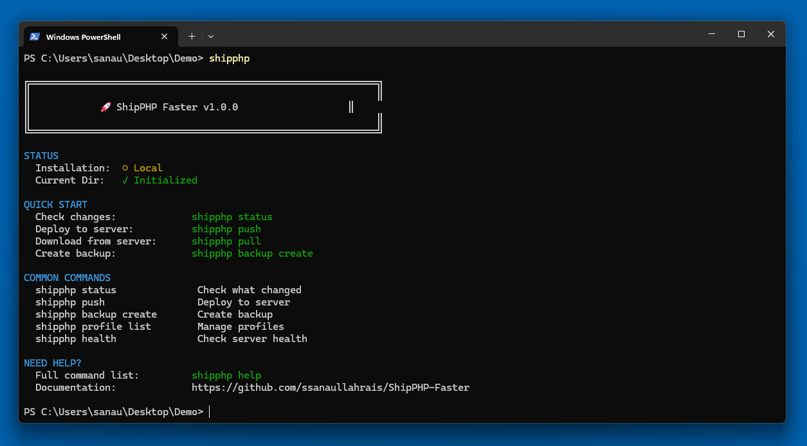

# ShipPHP Faster - The Easiest Way to Deploy Your PHP Website!

[](https://packagist.org/packages/shipphp/faster)
[](https://github.com/ssanaullahrais/ShipPHP-Faster/blob/main/LICENSE)
[](https://packagist.org/packages/shipphp/faster)



**Professional PHP Deployment Tool with Web UI, Global Installation & Profile Management!**

ShipPHP Faster is your all-in-one deployment toolkit for PHP websites. With a single command, push changes to server, pull updates, check deployment status, and instantly roll back with automatic version-tracked backups.

- **Web UI Dashboard** - Full browser-based management interface
- **Global installation** - Use from anywhere!
- **Multi-project support** - Manage unlimited websites
- **Automatic version-tracked backups** - Never lose your work!
- **Lightning fast** - Only uploads changed files
- **Works everywhere** - Shared hosting, VPS, any server with PHP

---

## Installation

```bash
composer global require shipphp/faster
```

That's it! ShipPHP is now available globally. **Requirements:** PHP 7.4+ and Composer

**Uninstall:**
```bash
composer global remove shipphp/faster
```

---

## Quick Start

```bash
# 1. Initialize your project
cd /path/to/your/project
shipphp init

# 2. Upload shipphp-server.php to your website via FTP/cPanel

# 3. Deploy!
shipphp status    # Check what changed
shipphp push      # Deploy to server
```

---

## All Commands

### Web UI
```bash
shipphp web                           # Launch Web UI at http://localhost:8080
shipphp web --port=3000               # Custom port
shipphp web --host=0.0.0.0            # Allow external access
shipphp web --open                    # Open browser automatically
```

### Setup & Configuration
```bash
shipphp init                          # Initialize project in current directory
shipphp login                         # Connect project to a global profile
shipphp bootstrap ./ship              # Create bootstrap file for shorter commands
shipphp env [name]                    # Switch between environments
```

### Deployment
```bash
shipphp                               # Smart dashboard (quick start guide)
shipphp status                        # Show changes since last sync
shipphp status --detailed             # Detailed status with diagnostics
shipphp push [path]                   # Upload changed files to server
shipphp pull [path]                   # Download changed files from server
shipphp sync                          # Status + Push (with confirmation)
shipphp push local.php --to=remote.php    # Push to specific server path
shipphp pull remote.php --to=local.php    # Pull to specific local path
```

### File Management
```bash
shipphp mkdir <path>                  # Create directory on server
shipphp touch <path>                  # Create empty file on server
shipphp write <path> --content="..."  # Write content to file
shipphp write <path> --from=local.txt # Write from local file
shipphp read <path>                   # Read file content from server
shipphp read <path> --save=local.txt  # Download to local file
shipphp copy <src> --to=<dest>        # Copy file/directory on server
shipphp chmod <path> 755              # Change file permissions
shipphp chmod <path> 644 --recursive  # Recursive permissions
shipphp info <path>                   # Get file/directory details
shipphp search "*.php"                # Search files by name pattern
shipphp search "config*" --path=src   # Search in specific directory
shipphp grep "function"               # Search file contents
shipphp grep "TODO" --pattern="*.php" # Search in specific file types
```

### Server Utilities
```bash
shipphp health                        # Check server health
shipphp health --detailed             # Detailed health diagnostics
shipphp stats                         # Show server statistics
shipphp logs                          # View server logs
shipphp logs --lines=100 --filter=error  # Filter logs
shipphp watch                         # Watch for file changes (realtime)
shipphp watch --interval=5            # Custom poll interval
shipphp tree [path]                   # Show server file tree
shipphp where                         # Show server base directory
shipphp delete <path>                 # Delete/trash files on server
shipphp delete <path> --pattern=*.log # Pattern-based deletion
shipphp delete <path> --permanent     # Permanently delete (no trash)
shipphp trash                         # List trashed items
shipphp trash restore <id>            # Restore from trash
shipphp move <path> --to=<dest>       # Move files on server
shipphp rename <path> --find=X --replace=Y  # Batch rename files
shipphp lock on --message="Maintenance"    # Enable maintenance mode
shipphp lock off                      # Disable maintenance mode
shipphp extract <zip>                 # Extract zip archive on server
```

### Backup Management
```bash
shipphp backup                        # List all local backups
shipphp backup create                 # Create local backup (auto-versioned)
shipphp backup create --server        # Create and upload to server
shipphp backup restore <id>           # Restore from local backup
shipphp backup restore <id> --server  # Download and restore from server
shipphp backup restore-server <id>    # Restore server files from server backup
shipphp backup sync <id>              # Upload specific backup to server
shipphp backup sync --all             # Upload all local backups to server
shipphp backup pull <id>              # Download specific backup from server
shipphp backup pull --all             # Download all backups from server
shipphp backup delete <id> --local    # Delete from local only
shipphp backup delete <id> --server   # Delete from server only
shipphp backup delete <id> --both     # Delete from both
shipphp backup delete --all           # Delete all backups (with confirmation)
shipphp backup stats                  # Show backup comparison table
```

### Profile Management
```bash
shipphp profile list                  # List all global profiles
shipphp profile add                   # Add new profile interactively
shipphp profile show <name>           # Show profile details
shipphp profile use <name>            # Set default profile
shipphp profile remove <name>         # Remove profile
shipphp server generate <name>        # Generate server file & create profile
```

### Security
```bash
shipphp token show                    # Show current authentication token
shipphp token rotate                  # Generate new token (requires server upload)
```

### Operation Planning
```bash
shipphp delete <path> --plan          # Queue operation instead of executing
shipphp plan                          # View queued operations
shipphp plan clear                    # Clear queued operations
shipphp apply                         # Execute all queued operations
```

### Utilities
```bash
shipphp help                          # Full command list
shipphp --version                     # Check version (with update notifications)
shipphp diff [file]                   # Show hash differences
```

---

## Web UI Dashboard

Launch a full-featured web dashboard to manage your deployments:

```bash
shipphp web
```

**Features:**
- **Setup Wizard** - Initialize project or select profile (same workflow as CLI)
- **Dashboard** - Overview stats, health status, server info
- **Status** - File change tracking (modified/new/deleted)
- **Push/Pull** - Deploy with progress indicators
- **File Explorer** - Browse, create, search, delete files
- **Backups** - Create, restore, delete backups
- **Trash** - Restore or permanently delete items
- **Plans** - View and execute queued operations
- **Logs** - Server log viewer with filtering
- **Settings** - Configuration and token management

**Toast Notifications** - Success, error, warning, info messages
**Progress Bars** - Real-time upload/download progress
**Responsive Design** - Works on desktop and mobile

---

## Profile Management

Manage multiple websites easily:

```bash
# List all profiles
shipphp profile list

# Add new profile
shipphp profile add my-client-site

# Show profile details
shipphp profile show my-blog-prod

# Set default profile
shipphp profile use my-blog-prod

# Remove profile
shipphp profile remove old-project
```

### Login Command

Connect any project to your saved profiles:

```bash
shipphp login

# Shows profile table:
┌────┬──────────────────────┬─────────────────────┬──────────────────┐
│ ID │ Profile              │ Project Name        │ Domain           │
├────┼──────────────────────┼─────────────────────┼──────────────────┤
│ 1  │ myblog-com-a3f9      │ My Personal Blog    │ myblog.com       │
│ 2  │ client-com-x8k2      │ Client Website      │ client.com       │
└────┴──────────────────────┴─────────────────────┴──────────────────┘

Select profile (1-2): 1
✓ Connected to: myblog-com-a3f9
```

---

## Real-World Workflows

### Freelancer with Multiple Clients

```bash
# Client 1 - Setup
shipphp server generate client1-prod
# Upload shipphp-server.php to client1.com

# Client 2 - Setup
shipphp server generate client2-staging
# Upload shipphp-server.php to staging.client2.com

# View all profiles
shipphp profile list

# Deploy to Client 1
cd /var/www/client1
shipphp login    # Select client1-prod
shipphp push

# Deploy to Client 2
cd /var/www/client2
shipphp login    # Select client2-staging
shipphp push
```

### Team with Shared Server

```bash
# Developer A (setup)
shipphp init    # Creates profile: company-prod
# Upload shipphp-server.php
# Share token with team (via 1Password, etc.)

# Developer B (join)
shipphp profile add company-prod
# Enter: URL and token from Developer A

# Both can deploy
cd /var/www/company-site
shipphp login    # Select company-prod
shipphp push
```

---

## Security Features

### Token-Based Authentication
- **64-character tokens** (256-bit security)
- **Timing-safe comparison** (prevents timing attacks)
- **Token rotation** (regenerate anytime)
- **Secure storage** (`chmod 600` on profile files)

### Path Protection
- **Path traversal prevention**
- **Cannot access files outside project directory**
- **Validated with `realpath()`**

### Network Security
- **Optional IP whitelisting** (CIDR support)
- **Rate limiting** (default: 120 req/min)
- **Request logging** (audit trail)

### File Security
- **SHA256 hashing** (integrity verification)
- **File size limits** (configurable)
- **Proper permissions** (files: 0644, directories: 0755)

---

## Automatic Backup System

### Version-Tracked Backups

Every backup gets an automatic semantic version:

```bash
shipphp backup create    # Creates: 2026-01-27-143022-v2.1.0
shipphp backup create    # Creates: 2026-01-27-143155-v2.1.1
shipphp backup create    # Creates: 2026-01-27-143301-v2.1.2
```

### Features
- **Automatic versioning** (v2.1.0, v2.1.1, v2.1.2...)
- **Version history tracking** (`.versions.json`)
- **Local & server sync** (upload/download backups)
- **Respects .gitignore** (only backs up relevant files)
- **Manifest system** (JSON metadata with file hashes)
- **Easy restore** (one command to rollback)

---

## Configuration

### shipphp.json (Local Project Config)
```json
{
  "version": "2.3.0",
  "serverUrl": "https://myblog.com/shipphp-server.php",
  "token": "64-character-token-here",
  "backup": {
    "enabled": true,
    "beforePush": true,
    "keepLast": 10
  },
  "ignore": [".git", "node_modules", "*.log"]
}
```

### ~/.shipphp/profiles.json (Global Profiles)
```json
{
  "profiles": {
    "myblog-com-a3f9": {
      "projectName": "My Blog",
      "domain": "myblog.com",
      "serverUrl": "https://myblog.com/shipphp-server.php",
      "token": "64-character-token-here"
    }
  },
  "default": "myblog-com-a3f9"
}
```

---

## Troubleshooting

### "Connection failed"
1. Upload `shipphp-server.php` to your website
2. Check URL: `https://yoursite.com/shipphp-server.php`
3. Verify token matches in both files

### "Profile not found"
```bash
shipphp profile list    # See all profiles
shipphp init            # Create new profile
```

### "Not initialized"
```bash
shipphp init            # Initialize current directory
# OR
shipphp login           # Link to existing profile
```

### "Token mismatch"
```bash
shipphp token show      # Check current token
shipphp token rotate    # Generate new token
# Re-upload shipphp-server.php!
```

---

## Why ShipPHP Faster?

| Feature | ShipPHP | FTP | Git Deploy |
|---------|---------|-----|------------|
| **Web UI** | ✅ | ❌ | ❌ |
| **Easy Setup** | ✅ | ✅ | ❌ |
| **Shared Hosting** | ✅ | ✅ | ❌ |
| **Change Detection** | ✅ | ❌ | ✅ |
| **Automatic Backups** | ✅ | ❌ | ❌ |
| **No SSH Required** | ✅ | ✅ | ❌ |
| **Multi-Project** | ✅ | Manual | Manual |
| **Profile System** | ✅ | ❌ | ❌ |

---

## Tips & Best Practices

1. **Use the Web UI** for visual management:
   ```bash
   shipphp web --open
   ```

2. **Always create backups** before major changes:
   ```bash
   shipphp backup create --server
   shipphp push
   ```

3. **Use profiles** for multi-project management:
   ```bash
   shipphp profile list
   shipphp login
   ```

4. **Rotate tokens regularly** (security best practice):
   ```bash
   shipphp token rotate
   ```

5. **Test with dry-run** before deploying:
   ```bash
   shipphp push --dry-run
   ```

6. **Stay updated**:
   ```bash
   composer global update shipphp/faster
   ```

---

## Documentation

- **GitHub:** https://github.com/ssanaullahrais/ShipPHP-Faster
- **Issues:** Report bugs or request features

---

## License

MIT License - Free to use for personal and commercial projects!

## Contributing

Contributions welcome! Please open an issue or pull request on GitHub.

## Support

If ShipPHP Faster helps you, please star the repository on GitHub!
